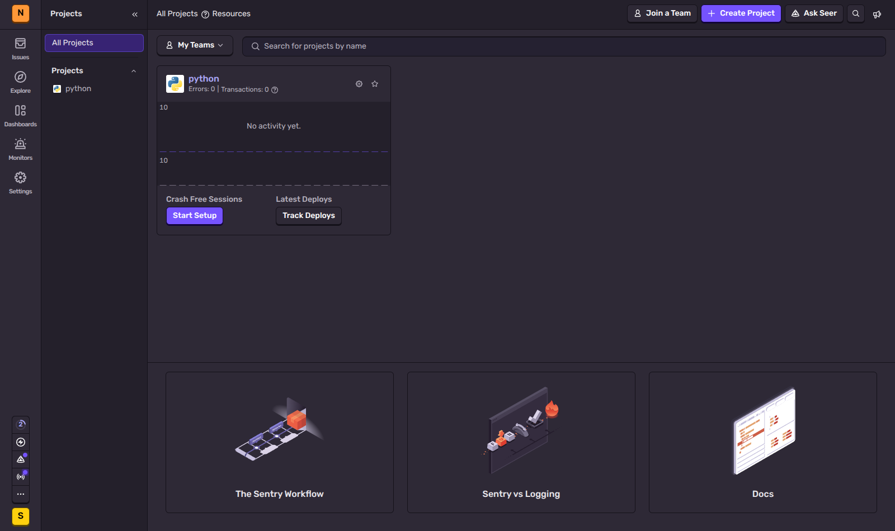
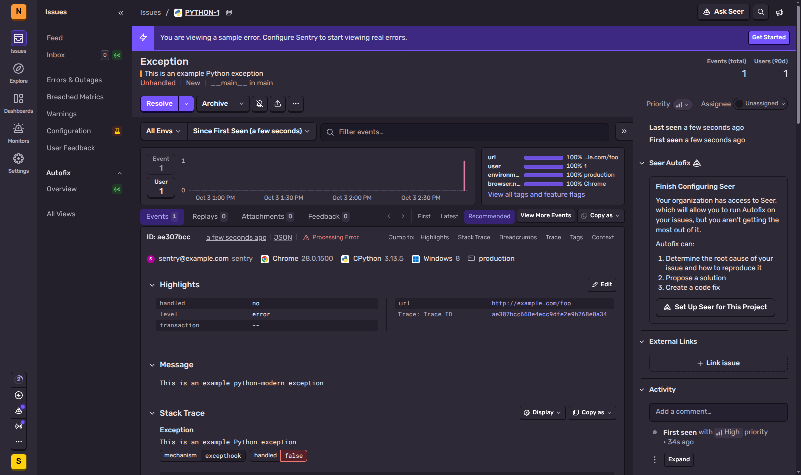
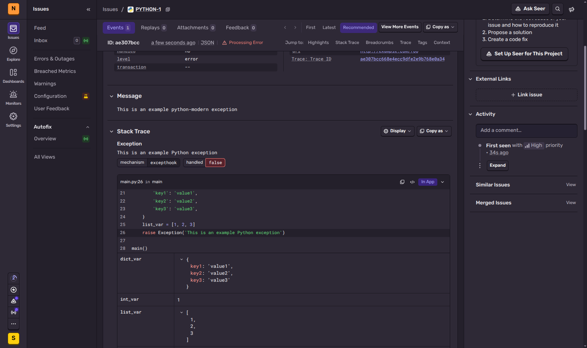
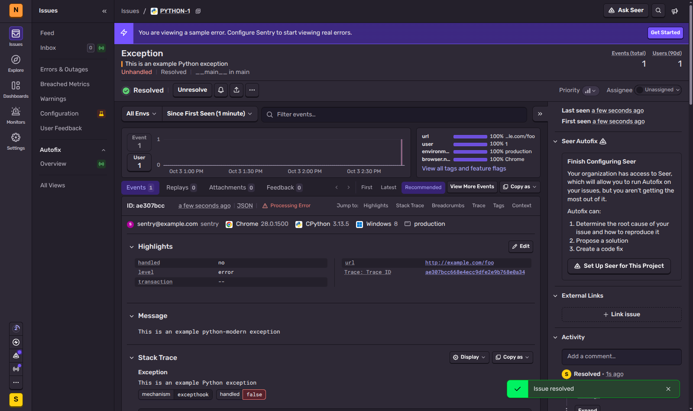
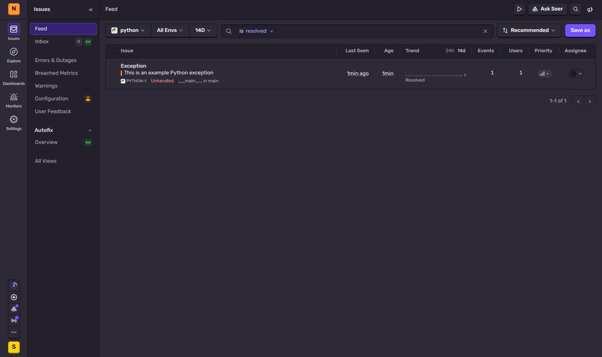
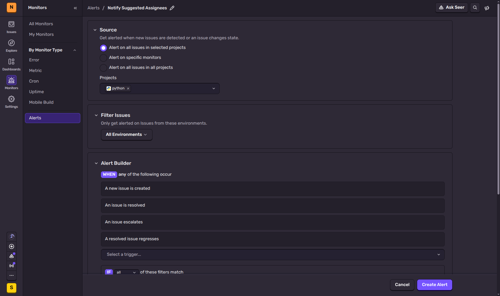
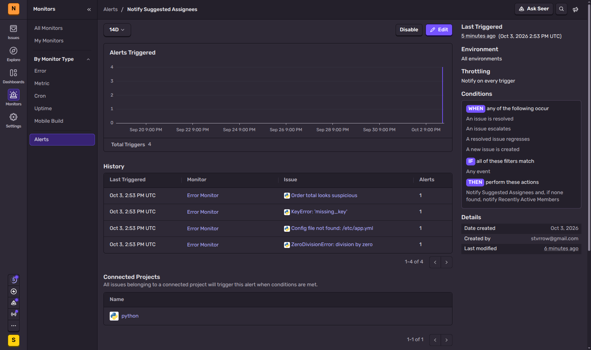
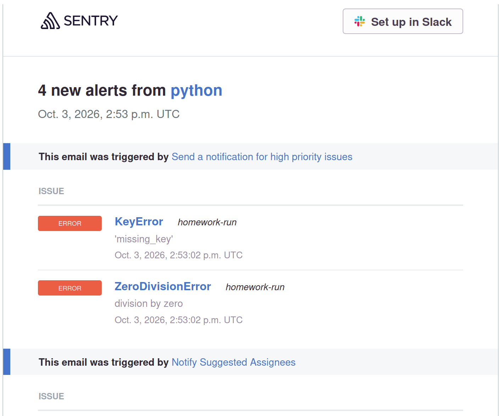
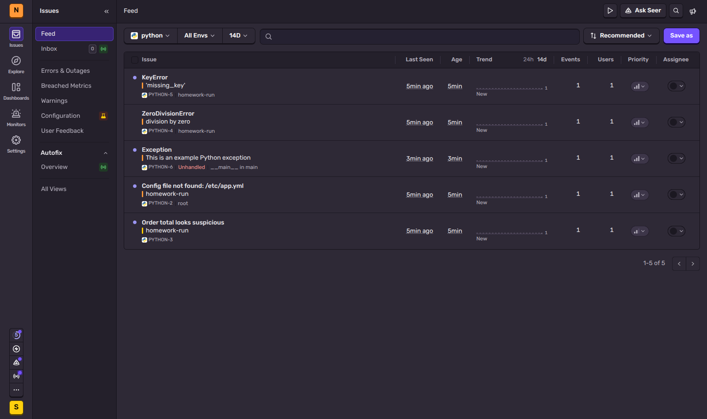
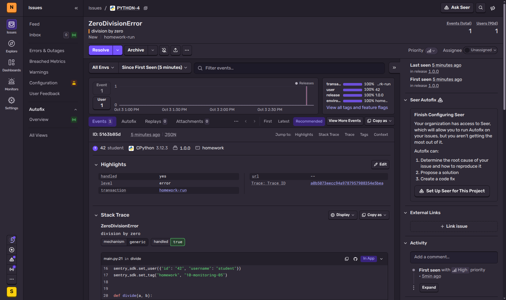

# Домашнее задание к занятию 16 «Платформа мониторинга Sentry» - Стрельников Александр

## Задание 1

Так как Self-Hosted Sentry довольно требовательная к ресурсам система, мы будем использовать Free Сloud account.

Free Cloud account имеет ограничения:

- 5 000 errors;
- 10 000 transactions;
- 1 GB attachments.

Для подключения Free Cloud account:

- зайдите на sentry.io;
- нажмите «Try for free»;
- используйте авторизацию через ваш GitHub-аккаунт;
- далее следуйте инструкциям.

В качестве решения задания пришлите скриншот меню Projects.

**Решение:**



#
## Задание 2

1. Создайте python-проект и нажмите `Generate sample event` для генерации тестового события.
1. Изучите информацию, представленную в событии.
1. Перейдите в список событий проекта, выберите созданное вами и нажмите `Resolved`.
1. В качестве решения задание предоставьте скриншот `Stack trace` из этого события и список событий проекта после нажатия `Resolved`.

**Решение:**

Создан проект `python` (платформа Python, без фреймворка) и сгенерировано sample event. В событии видны: тип и текст исключения (`Exception: This is an example Python exception`), признак `handled: no` (Unhandled), окружение `production`, пользователь, браузер и ОС из тестовых данных, теги, trace id, а в Stack Trace — файл, строка, исходный код вокруг строки и значения локальных переменных (`dict_var`, `int_var`, `list_var`).

Событие (баннер «You are viewing a sample error» подтверждает, что это sample event):



Stack trace:



Issue после нажатия `Resolve`:



Список событий проекта с фильтром `is:resolved` после нажатия `Resolve`:



#
## Задание 3

1. Перейдите в создание правил алёртинга.
2. Выберите проект и создайте дефолтное правило алёртинга без настройки полей.
3. Снова сгенерируйте событие `Generate sample event`.
Если всё было выполнено правильно — через некоторое время вам на почту, привязанную к GitHub-аккаунту, придёт оповещение о произошедшем событии.
4. Если сообщение не пришло — проверьте настройки аккаунта Sentry (например, привязанную почту), что у вас не было 
`sample issue` до того, как вы его сгенерировали, и то, что правило алёртинга выставлено по дефолту (во всех полях all).
Также проверьте проект, в котором вы создаёте событие — возможно алёрт привязан к другому.
5. В качестве решения задания пришлите скриншот тела сообщения из оповещения на почте.
6. Дополнительно поэкспериментируйте с правилами алёртинга. Выбирайте разные условия отправки и создавайте sample events. 

**Решение:**

Monitors → Alerts → Create Alert, проект `python`, все поля оставлены по умолчанию: All Environments, триггеры `any` из «A new issue is created / An issue is resolved / An issue escalates / A resolved issue regresses», фильтр `Any event`, действие — Notify Suggested Assignees, а если их нет — Recently Active Members (единственный участник организации — я).



Что показали эксперименты:

- Повторный sample event при уже существующем (resolved) sample issue попал в ту же группу — регрессии и письма не было, ровно как предупреждает п. 4.
- После удаления старого sample issue новый sample event создал новый issue (`PYTHON-6`), но правило на него **не сработало**: в текущей версии sentry.io sample-события не проходят через движок алертов.
- События, отправленные настоящим SDK (см. задание повышенной сложности), — 4 новых issue — сработали по условию «A new issue is created»: в истории правила 4 срабатывания, каждое из которых отправляет письмо на почту аккаунта Sentry.



Тело письма-оповещения:



#
## Задание повышенной сложности

1. Создайте проект на ЯП Python или GO (около 10–20 строк), подключите к нему sentry SDK и отправьте несколько тестовых событий.
2. Поэкспериментируйте с различными передаваемыми параметрами, но помните об ограничениях Free учётной записи Cloud Sentry.
3. В качестве решения задания пришлите скриншот меню issues вашего проекта и пример кода подключения sentry sdk/отсылки событий.

**Решение:**

Скрипт [app/main.py](app/main.py) (sentry-sdk 2.71.0). DSN не хранится в репозитории и передаётся через переменную окружения:

```bash
cd app
python3 -m venv .venv && .venv/bin/pip install sentry-sdk
SENTRY_DSN='https://<key>@<org>.ingest.de.sentry.io/<project>' .venv/bin/python main.py
```

```python
#!/usr/bin/env python3
"""Отправка тестовых событий в Sentry. DSN берётся из переменной окружения SENTRY_DSN."""
import logging
import os

import sentry_sdk
from sentry_sdk.integrations.logging import LoggingIntegration

sentry_sdk.init(
    dsn=os.environ["SENTRY_DSN"],
    environment="homework",
    release="netology-sentry@1.0.0",
    traces_sample_rate=1.0,  # транзакции тоже уходят в Sentry (лимит Free — 10k)
    integrations=[LoggingIntegration(level=logging.INFO, event_level=logging.ERROR)],
)
sentry_sdk.set_user({"id": "42", "username": "student"})
sentry_sdk.set_tag("homework", "10-monitoring-05")


def divide(a, b):
    return a / b


with sentry_sdk.start_transaction(op="task", name="homework-run"):
    # 1. необработанное деление на ноль, пойманное и отправленное вручную
    try:
        divide(1, 0)
    except ZeroDivisionError as e:
        sentry_sdk.capture_exception(e)

    # 2. сообщение с уровнем warning и дополнительным контекстом
    sentry_sdk.set_context("order", {"id": 1001, "amount": 250})
    sentry_sdk.capture_message("Order total looks suspicious", level="warning")

    # 3. logging.error превращается в событие через LoggingIntegration
    logging.info("breadcrumb: about to read config")  # попадёт в breadcrumbs
    logging.error("Config file not found: /etc/app.yml")

    # 4. KeyError с другим тегом
    with sentry_sdk.new_scope() as scope:
        scope.set_tag("component", "billing")
        try:
            {}["missing_key"]
        except KeyError as e:
            sentry_sdk.capture_exception(e)

sentry_sdk.flush()
print("events sent")
```

Какие параметры передаются и где их видно в Sentry:

- `environment="homework"`, `release="netology-sentry@1.0.0"` — окружение и релиз события (видны в шапке issue: `homework`, `1.0.0`);
- `set_user` — пользователь `42 student`; `set_tag` — тег `homework`, а для KeyError через отдельный scope — тег `component: billing`;
- `set_context("order", ...)` — произвольный контекст в разделе Context;
- `traces_sample_rate=1.0` + `start_transaction` — все события привязаны к транзакции `homework-run` (колонка под названием issue);
- `capture_exception` — handled-исключения с полным stack trace (ZeroDivisionError, KeyError);
- `capture_message(..., level="warning")` — событие-сообщение без исключения;
- `LoggingIntegration` — `logging.error` превращается в событие, `logging.info` попадает в breadcrumbs.

Меню Issues проекта (4 события из SDK + sample event `PYTHON-6` из задания 3):



Одно из событий SDK — видны пользователь, релиз, окружение, транзакция и stack trace с кодом `main.py`:


